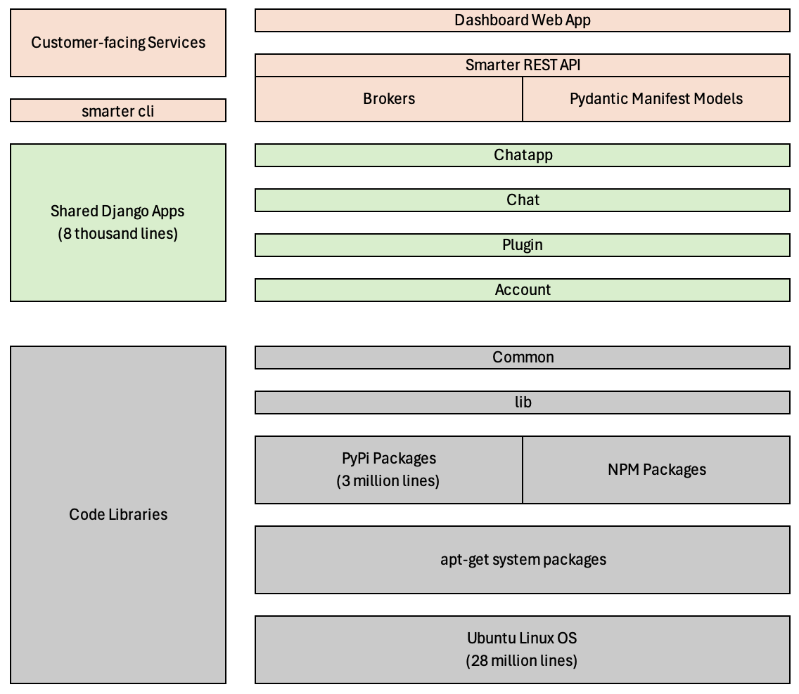
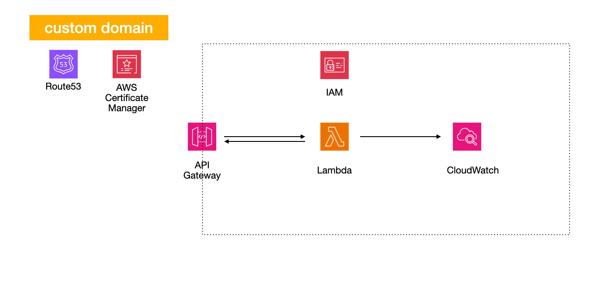

# Smarter Docs

Table of contents:

- [Developer Setup Guide](./CONTRIBUTING.md)
- [Example .env](./example-dot-env)
- [Code Management Best Practices](./GOOD_CODING_PRACTICE.md)
- [OpenAI JSON Examples](./OPENAI_JSON_EXAMPLES.md)
- [How to Get an OpenAI API Key](./OPENAI_API_GETTING_STARTED_GUIDE.md)
- [Semantic Versioning Guide](./SEMANTIC_VERSIONING.md)
- [Getting Started With AWS and Terraform](./TERRAFORM_GETTING_STARTED_GUIDE.md)
- [12-Factor Methodology](./12-FACTOR.md)

## Stack

## Repo

### Smarter Application

- **[Common](../smarter/smarter/common/)**: A collection of non-trivial helper functions ranging from interfaces to AWS backend services like SMTP email, to creation of expirable token-based urls. Of note is the [conf](../smarter/smarter/common/conf.py) module, built on [Pydantic](https://docs.pydantic.dev/), which handles the copious amount of configuration data on which Smarter depends.
- **[lib](../smarter/smarter/lib/)**: configurations for backing services like Celery and Redis.
- **[Account](../smarter/smarter/apps/account/)**: A Django app for managing enterprise accounts: user manager, permissions & roles, api keys, billing, payments, logs.
- **[Plugin](../smarter/smarter/apps/plugin/)**: A Django app implementing Smarter's extensibility model for LLM's offering a [function calling](https://platform.openai.com/docs/guides/function-calling) feature in their API.
- **[Chat](../smarter/smarter/apps/chat/)**: A Django app Langchain implementation of LLM-agnostic chat-completion service with seamless integration to [Plugin](../smarter/smarter/apps/plugin/) and enterprise logging features.
- **[Chatbot](../smarter/smarter/apps/chatbot)**: customer chat api deployment manager for custom domain, api keys and skinning options.
- **[Chatapp](../smarter/smarter/apps/chat/)**: A Django app implementing a ReactJS web UI for plugin-enabled chat. This is included in the dashboard as a prototyping/testing tool and is also included as a default front-end for customer apis.
- **[API](../smarter/smarter/apps/api/)**: Smarter's flagship product offering. Provides REST API endpoints for account management, plugin-enabled LLM requests, and customer api's.
- **[dashboard](../smarter/smarter/apps/dashboard/)**: The customer dashboard for performing prompt engineering development and testing, and for managing an enterprise account.

### Everything Else In This Repo

- **[aws](../aws/terraform/)**: A set of Terraform infrastructure-as-code scripts for managing AWS resources in test, staging and production.
- **[Helm](../helm/charts/smarter/)**: A set of yaml 'charts' for configuring and deploying Smarter to Kubernetes.
- **[Dockerfile](../Dockerfile)**: A single-file definition for building the Smarter application as a run-anywhere Docker container.
- **[Docker-compose](..ker-compose.yml)**: A single-file definition for deploying the Smarter application and its backing services as integrated Docker containers.
- **[.github](../smarter/.github)**: GitHub Actions workflows for automated build and deployment to AWS
- **[.env](../.env)**: A set of configuration data for local development.
- **[Makefile](../Makefile)**: A set of scripts for use in local development that provide shortcuts for common chores.

## Smarter API

TO DO: DOCUMENT THE PRIMARY API ENDPOINT FOR HANDLING LLM REQUESTS

## Technologies Used In The Application Stack

### Python

[Python](https://www.python.org/) is a popular high-level, general-purpose object-oriented programming language. It enjoys broad support across all common operating environments. Its design philosophy emphasizes code readability with the use of significant indentation. Python is dynamically typed and garbage-collected. It supports multiple programming paradigms, including structured, object-oriented and functional programming.

_Why do we use it: Python has become an ecosystem of choice for the data science community. By standardizing on Python we are assured open-source access to the most important 3rd party code libraries like Matplotlib, Sckikit-learn, Pandas, SciPy, NumPy, Seaborn and Keras._

### NodeJS

[Node.js](https://nodejs.org/) is a cross-platform, open-source JavaScript runtime environment that can run on Windows, Linux, Unix, macOS, and more. Node.js runs on the V8 JavaScript engine, and executes JavaScript code outside a web browser. Node.js lets developers use JavaScript to write command line tools and for server-side scripting.

_Why do we use it: We're less interested in NodeJS itself as opposed to its package manager NPM, which contains supporting component libraries for our React-based chat front-end as well as for code quality tools that we use in this repo._

### Django

[Django](https://www.djangoproject.com/) is a free and open-source, Python-based web framework that runs on a web server. It follows the model–template–views architectural pattern. It is community supported and maintained by the Django Software Foundation.

_Why do we use it: Aside from being a fantastic web framework, Django is arguably the best way to integrate Python to sophisticated backing services like MySQL, Redis and Celery. Django's Object Relational Model is unparalled in this regard._

### Django REST Framework

[Django REST framework](https://www.django-rest-framework.org/) is a powerful and flexible toolkit for building Web APIs. Some reasons you might want to use REST framework: The Web browsable API is a huge usability win for your developers.

_Why do we use it: given that we're standardized on Python-Django, Django REST framework is the gold standard for implementing sophisticated REST APIs._

### Django Waffle

[Waffle](https://waffle.readthedocs.io/en/stable/) is feature flipper for Django. You can define the conditions for which a flag should be active, and use it in a number of ways.

### Pydantic

[Pydantic](https://docs.pydantic.dev/) is a Python package that can offer simple data validation and manipulation. It was developed to improve the data validation process for developers. Indeed, Pydantic is an API for defining and validating data that is flexible and easy to use, and it integrates seamlessly with Python's data structures.

_Why do we use it: validating data is harder than it seems, and it's thankless work. Pydantic does this WAY better than we ever could on our own._

### Redis

[Redis](https://redis.io/) is a source available in-memory storage, used as a distributed, in-memory key–value database, cache and message broker, with optional durability.

_Why do we use it: a couple of reasons actually. First, in order to run Python at scale you need an effictive object caching strategy, which becomes surprisingly complex early on. Redis does this well, and so it's common to see Python and Redis paired in large deployments. Additionally, Redis works well as a message broker. See 'Celery' below for details._

### Celery

[Celery](https://docs.celeryq.dev/en/stable/) is an open source asynchronous task queue or job queue which is based on distributed message passing. While it supports scheduling, its focus is on operations in real time.

_Why do we use it: Celery is an excellent 3rd party library for managing asynchronous and distributed tasks, which is more complicated to manage than might seem. Smarter primarily leverages celery for generating and persisting customer billing data real-time._

### ReactJS

[React](https://react.dev/) is a free and open-source front-end JavaScript library for building user interfaces based on components. It is maintained by Meta and a community of individual developers and companies. React can be used to develop single-page, mobile, or server-rendered applications with frameworks like Django REST framework.

_Why do we use it: all modern chat applications (think for example, whatsapp web) use front-end javascript frameworks that provide a means of manipulating the DOM without rerendering the page on each change. Our chat app needs to measure up to this pretty high bar. Of those frameworks, React is arguably the most popular._

## Cloud Infrastructure Technologies

### Terraform

[Terraform](https://www.terraform.io/) is an infrastructure-as-code software tool created by HashiCorp. Users define and provide data center infrastructure using a declarative configuration language known as HashiCorp Configuration Language, or optionally JSON.

_Why do we use it: Setting up the cloud infrastructure for a serverless, horizontally scalable platform like Smarter is surprisingly complicated. And in our case we manage at least three fully-functional environments that run side-by-side. We're highly reliant on Terraform to give us the means of confidently managing this much complexity._

### Docker

[Docker](https://www.docker.com/) is a set of platform as a service products that use OS-level virtualization to deliver software in packages called containers. The service has both free and premium tiers. The software that hosts the containers is called Docker Engine. It was first released in 2013 and is developed by Docker, Inc.

_Why do we use it: The Smarter project consists of around 3 million lines of code written in dozens of languages. Only around 20,000 lines of this codebase were written by us. Building the application involves consistently pulling in several hundred interdependent 3rd party code libraries, consolidating thousands of web assets, and configuring all of this so that it runs reliably. Moreover, some of this code behaves differently depending on the os environmetn and filesystem in which it runs. Docker provides a means managing this level of complexity in a simple, declarative way that for the most part is platform agnostic. We use Docker for local development as well as for deploying to Kubernetes on AWS._

### AWS Elastic Container Registry

[Amazon Elastic Container Registry](https://aws.amazon.com/ecr/) (Amazon ECR) is a fully managed container registry offering high-performance hosting, so you can reliably deploy application images and artifacts anywhere.

_What do we use it: ECR is a private alternative to Docker Hub. It's a private place in the cloud where we can store the Docker containers that we build. Once we push a container to ECR, it becomes available to any Docker-based compute service inside of AWS._

### Kubernetes

[Kubernetes](https://kubernetes.io/) is an open-source container orchestration system for automating software deployment, scaling, and management. Originally designed by Google, the project is now maintained by a worldwide community of contributors, and the trademark is held by the Cloud Native Computing Foundation.

_Why do we use it: as you scale, managing where to run individual containers becomes unwieldy. Kubernetes does this exceptionally well. It does a lot of other things well, but in our case container orchestration is the overarching reason we use Kubernetes._

### Helm

[Helm](https://helm.sh/) helps you manage Kubernetes applications — Helm Charts help you define, install, and upgrade even the most complex Kubernetes application. Charts are easy to create, version, share, and publish.

Why we use it: Helm is the Kubernetes equivalent of the [docker-compose.yml](..ker-compose.yml) file in this repo for deploying the application and its backing services locally on your dev machine. It serves exactly the same purpose, but also provides useful version management features as well.

### GitHub Actions

[GitHub Actions](https://github.com/features/actions) is a continuous integration and continuous delivery (CI/CD) platform that allows you to automate your build, test, and deployment pipeline. You can create workflows that build and test every pull request to your repository, or deploy merged pull requests to production.

_Why we use it: first, automating build and deployment workflows saves us tons of time and affords us more consistency in terms of the final results. But amongst competing CI/CD platform options GitHub Actions stands apart in terms of the seamless integration to GitHub repos as well as its quite-substantial 3rd party component support for other technology ecosystems like Docker, AWS and Kubernetes. Our GitHub Actions workflows are remarkably resilient, easy to read, and required minimal maintenance._

### Dependabot & Mergify

[Dependabot](https://docs.github.com/en/code-security/getting-started/dependabot-quickstart-guide) is a feature of GitHub whose main purpose is to assist developers in staying on top of their dependency ecosystem. It does this by automating the dependency update process which in turn proactively addresses any potential security concerns.

[Mergify](https://mergify.com/) is an automation service that helps to streamline the process of merging pull requests on GitHub. It allows you to define rules for merging pull requests, which can help to automate your workflow. For example, you can set up Mergify to automatically merge pull requests when they pass all status checks, or when they've been approved by a certain number of reviewers. This can help to save time and ensure that your project's main branch is always up to date with the latest changes.

Why we use them: Some of the 3rd party packages on which we rely -- openai, langchain and React all come to mind -- are frequently updated. Its not uncommon for dozens of Smarter's 3rd party requirements to be updated over the course of one week. When combined with our automated build-deploy workflow for our test environment, we're able to automatically update these requirements, re-test everything, and if all go well then propagate these changes to all branches in the repo. This keeps our codebase in tip-top condition while saving us tons of time.

## AWS Deployment Infrastructure

TO DO: UPDATE ME PLEASE. WE MOVED TO KUBERNETES IN JAN-2024.

- **[IAM](https://aws.amazon.com/iam/)**: a web service that helps you securely control access to AWS resources. With IAM, you can centrally manage permissions that control which AWS resources users can access. You use IAM to control who is authenticated (signed in) and authorized (has permissions) to use resources.
- **[S3](https://aws.amazon.com/s3/)**: Amazon Simple Storage Service is a service offered by Amazon Web Services that provides object storage through a web service interface. Amazon S3 uses the same scalable storage infrastructure that Amazon.com uses to run its e-commerce network.
- **[Certificate Manager](https://aws.amazon.com/certificate-manager/)**: handles the complexity of creating, storing, and renewing public and private SSL/TLS X.509 certificates and keys that protect your AWS websites and applications.
- **[CloudFront](https://aws.amazon.com/cloudfront/)**: Amazon CloudFront is a content delivery network (CDN) service built for high performance, security, and developer convenience.
- **[EKS](https://aws.amazon.com/eks/)**: Amazon Elastic Kubernetes Service (Amazon EKS) is a managed Kubernetes service to run Kubernetes in the AWS cloud and on-premises data centers. In the cloud, Amazon EKS automatically manages the availability and scalability of the Kubernetes control plane nodes responsible for scheduling containers, managing application availability, storing cluster data, and other key tasks.
- **[ECR](https://aws.amazon.com/ecr/)**: Amazon Elastic Container Registry (Amazon ECR) is a fully managed container registry offering high-performance hosting, so you can reliably deploy application images and artifacts anywhere.
- **[Route53](https://aws.amazon.com/route53/)**: a scalable and highly available Domain Name System service. Released on December 5, 2010.
- **[SES](https://aws.amazon.com/ses/)**: Amazon Simple Email Service (Amazon SES) lets you reach customers confidently without an on-premises Simple Mail Transfer Protocol (SMTP) email server using the Amazon SES API or SMTP interface.
- **[CloudWatch](https://aws.amazon.com/cloudwatch/)**: CloudWatch enables you to monitor your complete stack (applications, infrastructure, network, and services) and use alarms, logs, and events data to take automated actions and reduce mean time to resolution (MTTR).
